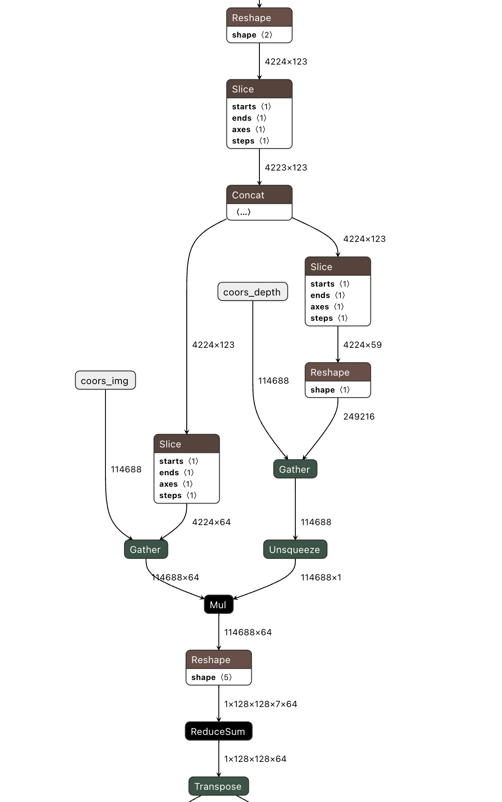

# FastBEV++

## Get Started

Please prepare the training environment according to [BEVDet](https://github.com/HuangJunJie2017/BEVDet?tab=readme-ov-file#get-started).  

training script:

```shell
./tools/dist_train.sh configs/fastbev/paper/fastbev-r50-cbgs.py 8
```

test script:

```shell
./tools/dist_test.sh configs/fastbev/paper/fastbev-r50-cbgs.py work_dirs/fastbev-r50-cbgs/epoch_20_ema.pth 8 --eval mAP 2>&1 | tee work_dirs/fastbev-r50-cbgs/epoch_20_ema.pth.log
```

## Main Results

Prepared ckpts: 

- [fastbev-r50-cbgs](https://drive.google.com/drive/folders/1AYtoX8XaNg8ZckFBgbo2TVmyXb26Dw2V?usp=sharing)
- [fastbev-r50-cbgs-4d](https://drive.google.com/drive/folders/1XBcftoEn_2TkpG-qQAo66Oa8_hEnfoqi?usp=sharing)


## Inference latency

Exported onnx: [Google Drive](https://drive.google.com/file/d/1qefFlah6PkKPtz0Zgh9aqn0rqITjU2C8/view?usp=sharing)




## Acknowledgement

This project is not possible without multiple great open-sourced code bases. We list some notable examples below.

- [open-mmlab](https://github.com/open-mmlab)
- [CenterPoint](https://github.com/tianweiy/CenterPoint)
- [Lift-Splat-Shoot](https://github.com/nv-tlabs/lift-splat-shoot)
- [Swin Transformer](https://github.com/microsoft/Swin-Transformer)
- [BEVFusion](https://github.com/mit-han-lab/bevfusion)
- [BEVDepth](https://github.com/Megvii-BaseDetection/BEVDepth)
- [BEVerse](https://github.com/zhangyp15/BEVerse)  for multi-task learning.
- [BEVStereo](https://github.com/Megvii-BaseDetection/BEVStereo)  for stero depth estimation.
- [BEVDet](https://github.com/HuangJunJie2017/BEVDet)
- [Fast-BEV](https://github.com/Sense-GVT/Fast-BEV)
